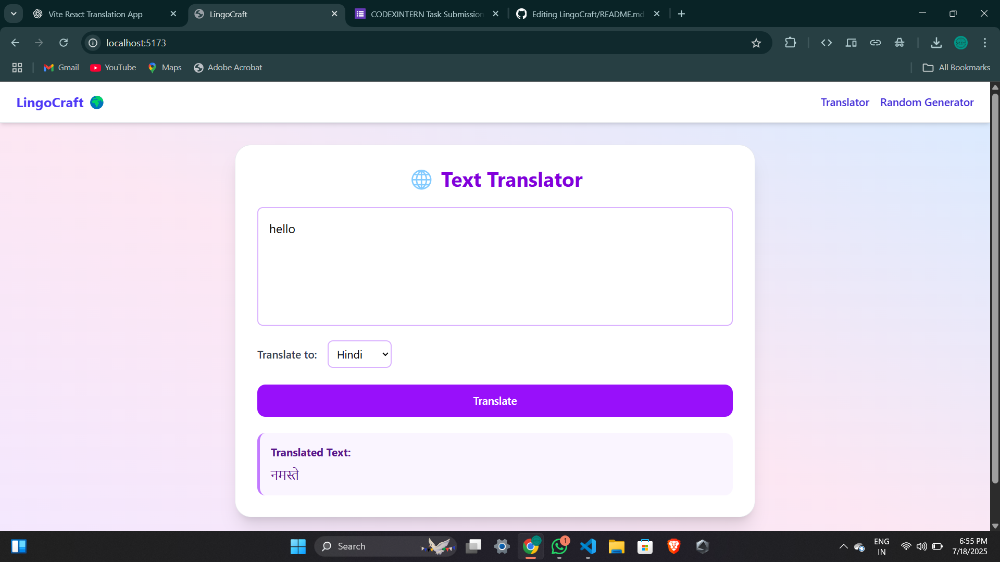
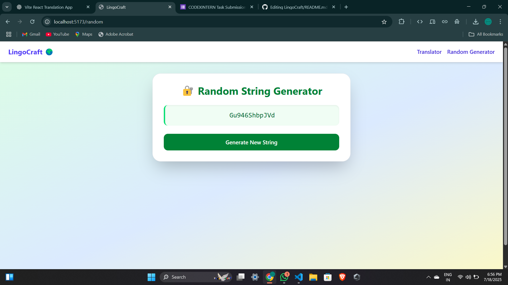

# 🌍 LingoCraft

LingoCraft is a beginner-friendly React app that combines two powerful utilities:

- A **Text Translator** using the [MyMemory API](https://mymemory.translated.net/).
- A **Random String Generator** using React hooks.

This is a fun project to explore React fundamentals, client-side routing, API calls, and Tailwind CSS for modern UI styling.

---

## ✨ Features

- Translate English text into multiple languages  
- Select from languages like Spanish, French, Hindi, German  
- Generate random strings using `useState`, `useEffect`, and `useCallback`  
- Responsive, modern UI with Tailwind CSS  
- Seamless client-side routing using `react-router-dom`

---

## 🛠️ Tech Stack

- [Vite](https://vitejs.dev/) + [React](https://reactjs.org/)
- [Tailwind CSS](https://tailwindcss.com/)
- [Axios](https://axios-http.com/)
- [React Router DOM](https://reactrouter.com/)
- [MyMemory API](https://mymemory.translated.net/)

---

## 🚀 Getting Started

### 1. Clone the repository

```bash
git clone https://github.com/Ayush-Sareen/LingoCraft.git
cd LingoCraft
```
2. Install dependencies
```bash
npm install
```
3. Start the development server
```bash
npm run dev
```
## 📸 Screenshots

### 🌍 Translator


### 🔐 Random String Generator


🌐 Live Demo
Coming Soon — Deploy on Netlify or Vercel

📂 Project Structure
```css
src/
├── pages/
│   ├── Translator.jsx
│   └── RandomString.jsx
├── components/
│   └── Navbar.jsx
├── App.jsx
└── main.jsx
```
## 🧠 Learnings
- How to build a React app with multiple pages
- Using MyMemory API for translation
- React hooks (useState, useEffect, useCallback)
- Styling UI with Tailwind CSS
- Setting up client-side routing
